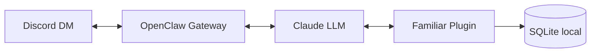

<p align="center">
  
</p>

<h1 align="center">Familiar</h1>

<p align="center">
  A personal CRM and project tracker that lives in Discord.<br />
  You just talk to it.
</p>

<p align="center">
  
  
  
  
  
</p>

---

## How it works

Familiar is an [OpenClaw](https://openclaw.ai/) plugin. You DM a Discord bot, OpenClaw hands the message to Claude, Claude calls Familiar's tools against a local SQLite database, and the answer comes back to Discord.



1. You send a message in Discord, plain English
2. OpenClaw receives it and forwards to Claude with the active skill prompt
3. Claude reads your intent and calls one or more Familiar tools (add a contact, log an interaction, check follow-ups, etc.)
4. Familiar runs the query against your local SQLite database and returns structured results
5. Claude turns the results into a normal response and sends it back through Discord

Everything stays on your machine. No cloud database, no data leaving your box.

---

## Skills

Familiar ships with two skills, which are system prompts that tell Claude how to behave and which tools to use.

### CRM skill

Manages your personal network across three relationship tiers.

| Tool | What it does |
|------|-------------|
| `crm_add_contact` | Add a contact with name, tier, company, birthday, and any other details |
| `crm_update_contact` | Update any field on an existing contact |
| `crm_find_contact` | Search by name, company, or notes. Returns top 5 with recent interactions |
| `crm_list_contacts` | List all contacts, optionally filtered by tier (vip / acquaintance / broader) |
| `crm_log_interaction` | Log a touchpoint (text, email, call, coffee, linkedin, event, other). Resets the follow-up timer |
| `crm_search_by_industry` | Find contacts by industry or company |
| `crm_get_upcoming_followups` | Show contacts due for a check-in within N days |
| `crm_get_upcoming_birthdays` | Show contacts with birthdays in the next N days |
| `crm_add_schema_column` | Add a new column to the database at runtime |
| `crm_add_tag` | Tag a contact with a label |
| `crm_find_by_tag` | Find all contacts with a given tag |

Follow-up cadence is automatic based on tier:

| Tier | Cadence |
|------|---------|
| `vip` | Every 3 weeks |
| `acquaintance` | Every 6 weeks |
| `broader` | Every 3 months |

The schema grows with you. Mention "his dog's name is Rex" and the agent creates a `dog_name` column and stores the value. No config changes, no restarts. The `schema_meta` table tracks every column that gets added this way.

### Project manager skill

Tracks projects, tasks, progress logs, and deadlines with 48-hour heartbeat check-ins.

| Tool | What it does |
|------|-------------|
| `pm_create_project` | Create a project with name, slug, goal, role, org, and dates |
| `pm_list_projects` | List projects, optionally filtered by status (active / paused / completed / archived) |
| `pm_add_task` | Add a task with title, priority (low through urgent), due date, and notes |
| `pm_update_task` | Update task fields. Setting status to `done` auto-fills `completed_at` |
| `pm_list_tasks` | List tasks for a project, ordered by priority (urgent first) |
| `pm_log_entry` | Log a dated entry with summary and tags (#meeting, #decision, #blocker, etc.) |
| `pm_get_project_summary` | Full summary: open/overdue/completed task counts and recent log entries |

### Shared tool

| Tool | What it does |
|------|-------------|
| `bot_propose_change` | The agent can propose changes to its own codebase. Creates a branch, writes files, commits, pushes, and opens a PR for review |

---

## Database

Eight tables across two domains, all append-only:

**CRM:** `contacts`, `interactions`, `tags`, `contact_tags`, `schema_meta`

**Projects:** `projects`, `tasks`, `project_logs`

Nothing gets deleted. Contacts you don't need move to the `broader` tier. Old projects get `archived`. If something is wrong, it gets updated, not removed.

---

## Setup

### Prerequisites

- Node.js >= 22
- [OpenClaw](https://openclaw.ai/) installed:
  ```bash
  curl -fsSL https://openclaw.ai/install.sh | bash
  ```
- A Discord bot token from the [Discord Developer Portal](https://discord.com/developers/applications)
- An Anthropic API key (configured during `openclaw onboard`)

### Install

```bash
git clone https://github.com/Mason-Levyy/familiar
cd familiar
npm install
npm run build
```

### Initialize the database

```bash
npm run db:init
```

### Connect to OpenClaw

```bash
# Run the onboarding wizard (sets up API keys and the background daemon)
openclaw onboard --install-daemon

# Load the Familiar plugin
openclaw plugins install /path/to/familiar

# Install skills (system prompts)
mkdir -p ~/.openclaw/workspace/skills/crm
cp skills/crm/SKILL.md ~/.openclaw/workspace/skills/crm/SKILL.md
mkdir -p ~/.openclaw/workspace/skills/project-manager
cp skills/project-manager/SKILL.md ~/.openclaw/workspace/skills/project-manager/SKILL.md

# Connect Discord
openclaw config set channels.discord.enabled true --json
openclaw config set channels.discord.token '"YOUR_BOT_TOKEN"' --json
```

### Lock down access

Edit `~/.openclaw/config.json5` to restrict Familiar to your Discord account:

```json5
{
  channels: {
    discord: {
      enabled: true,
      dmPolicy: "allowlist",
      allowFrom: ["YOUR_DISCORD_USER_ID"]
    }
  }
}
```

### Run

```bash
openclaw gateway
```

DM your Discord bot to start.

---

## Backups

```bash
# Manual backup
bash scripts/backup_db.sh

# Schedule a daily backup at 3 AM via cron
crontab -e
# Add: 0 3 * * * bash /path/to/familiar/scripts/backup_db.sh
```

---

## Security

- **Single-user.** Discord allowlist restricts access to one account.
- **Append-only.** No delete operations. Data is always recoverable.
- **Local-only.** SQLite on your machine, nothing in the cloud.
- **Secrets stay out of git.** `.env` is gitignored; credentials live in OpenClaw config.

Run `openclaw doctor` to diagnose configuration issues.
